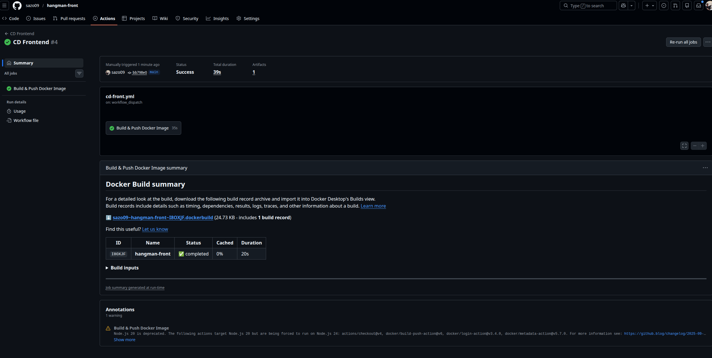
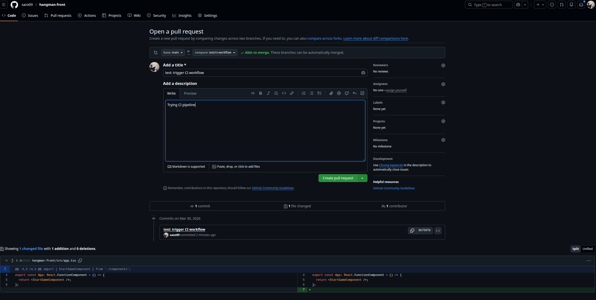
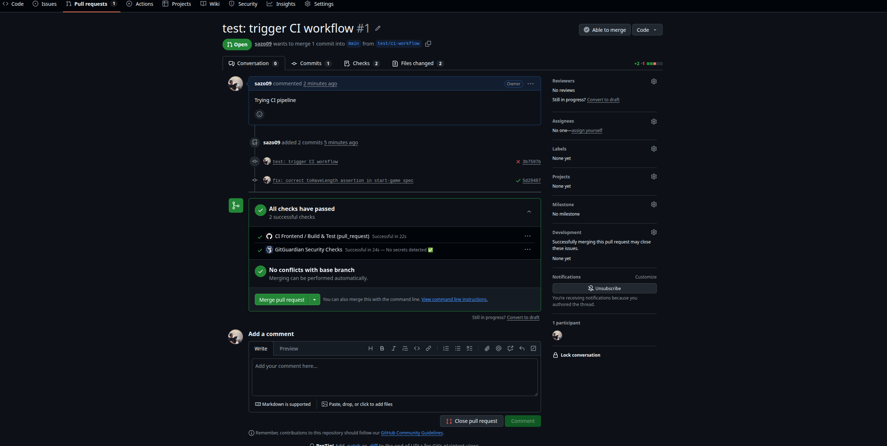
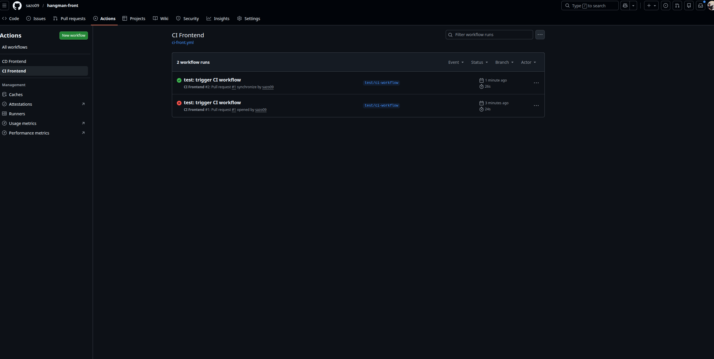
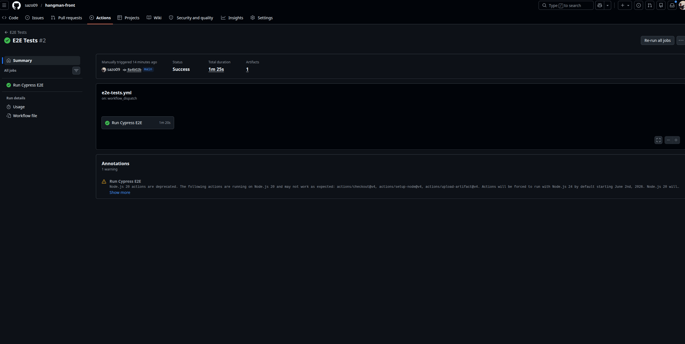
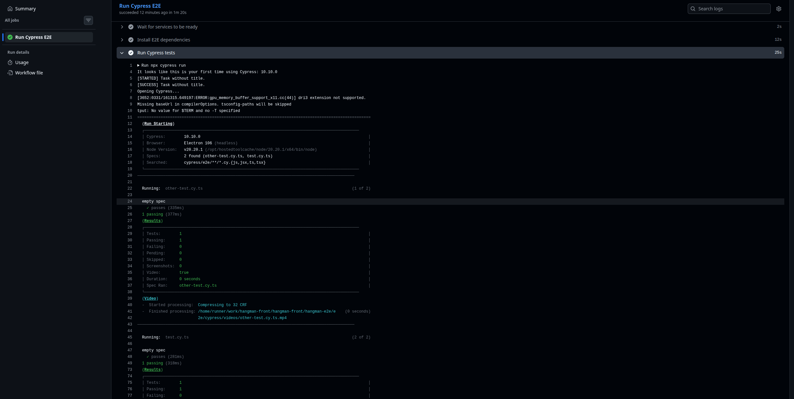

# Ejercicios GitHub Actions - Frontend

Este repositorio cumple con los dos ejercicios obligatorios solicitados para `hangman-front`.

## 1) Workflow CI - OBLIGATORIO

Archivo: `.github/workflows/ci-front.yml`

Configuracion implementada:

- Se dispara en `pull_request`.
- Solo se ejecuta si hay cambios en `hangman-front/**`.
- Ejecuta build del frontend.
- Ejecuta unit tests del frontend.

En resumen, el workflow cumple la condicion pedida: PR + cambios en `hangman-front/**`.

## 2) Workflow CD - OBLIGATORIO

Archivo: `.github/workflows/cd-front.yml`

Configuracion implementada:

- Se dispara manualmente con `workflow_dispatch`.
- Construye una nueva imagen Docker del frontend.
- Publica la imagen en GitHub Container Registry (GHCR).

## Evidencia (capturas)

Capturas del flujo y resultado:

## 3) Workflow E2E Tests - OPCIONAL

Archivo: `.github/workflows/e2e-tests.yml`

Configuracion implementada:

- Se dispara manualmente con `workflow_dispatch`.
- Construye las imagenes Docker de `hangman-api` y `hangman-front` desde el codigo fuente.
- Levanta ambos contenedores en el runner:
  - API en `localhost:3001`
  - Front en `localhost:8080` con `API_URL=http://localhost:3001`
- Espera que ambos servicios esten listos antes de ejecutar los tests.
- Ejecuta los tests E2E con Cypress en modo headless (`cypress run`).
- Sube screenshots y videos como Artifacts en caso de fallo.
- Para y elimina los contenedores siempre al finalizar (`if: always()`).

### Pasos para ejecutar

1. Ir a la pestana **Actions** del repositorio.
2. Seleccionar **E2E Tests** en el panel izquierdo.
3. Pulsar **Run workflow** sobre la rama `main`.
4. Esperar a que el job complete los siguientes stages:
   - Build API Docker image
   - Build Front Docker image
   - Start API container
   - Start Front container
   - Wait for services to be ready
   - Install E2E dependencies
   - Run Cypress tests
5. Si el job falla, descargar los Artifacts (`cypress-artifacts`) para ver screenshots y videos de Cypress.

### Evidencia (capturas)

## Referencias rapidas

- CI: `.github/workflows/ci-front.yml`
- CD: `.github/workflows/cd-front.yml`
- E2E: `.github/workflows/e2e-tests.yml`
- Proyecto frontend: `hangman-front/`
- Proyecto API: `hangman-api/`
- Tests E2E: `hangman-e2e/e2e/`