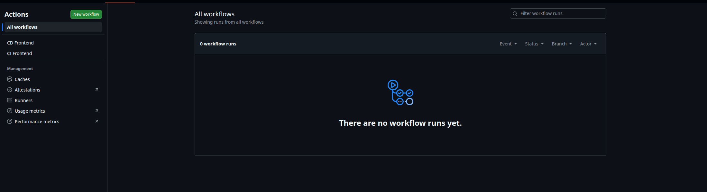

# Ejercicios GitHub Actions - Frontend

Este repositorio cumple con los dos ejercicios obligatorios solicitados para `hangman-front`.

## 1) Workflow CI - OBLIGATORIO

Archivo: `.github/workflows/ci-front.yml`

Configuracion implementada:

- Se dispara en `pull_request`.
- Solo se ejecuta si hay cambios en `hangman-front/**`.
- Ejecuta build del frontend.
- Ejecuta unit tests del frontend.

En resumen, el workflow cumple la condicion pedida: PR + cambios en `hangman-front/**`.

## 2) Workflow CD - OBLIGATORIO

Archivo: `.github/workflows/cd-front.yml`

Configuracion implementada:

- Se dispara manualmente con `workflow_dispatch`.
- Construye una nueva imagen Docker del frontend.
- Publica la imagen en GitHub Container Registry (GHCR).

## Evidencia (capturas)

Capturas del flujo y resultado:

## Referencias rapidas

- CI: `.github/workflows/ci-front.yml`
- CD: `.github/workflows/cd-front.yml`
- Proyecto frontend: `hangman-front/`